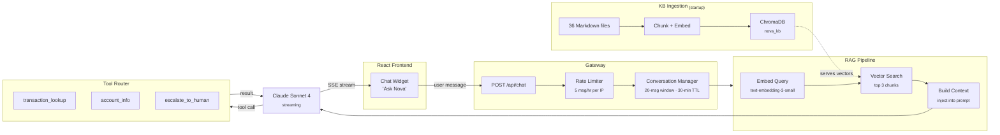

# Nova

AI-powered customer support agent embedded in a neobank dashboard. Built by [Devbrew](https://devbrew.ai).

## Tech stack

| Layer      | Technology                                                       |
| ---------- | ---------------------------------------------------------------- |
| Frontend   | React 19, TypeScript, Vite, Tailwind CSS, Base UI (shadcn-style) |
| Backend    | Python 3.11+, FastAPI                                            |
| LLM        | Claude Sonnet 4 (`claude-sonnet-4-20250514`)                     |
| Embeddings | OpenAI `text-embedding-3-small`                                  |
| Vector DB  | ChromaDB                                                         |
| Streaming  | Server-Sent Events (SSE)                                         |

## Architecture

A React dashboard renders the mock neobank UI and an "Ask Nova" floating chat bubble. The bubble streams over SSE to a FastAPI backend that runs a RAG pipeline (OpenAI embeddings → ChromaDB) and dispatches tool calls (transaction lookup, account info, human escalation) before streaming the LLM response back.

### How the AI agent works



**Flow:** User sends a message → rate limiter checks → conversation history is loaded → the RAG pipeline embeds the query and retrieves relevant knowledge base chunks from ChromaDB → retrieved context is injected into the system prompt → Claude generates a response, optionally calling tools (transaction lookup, account info, or escalation) → the response streams back to the chat widget as SSE events.

## Quick start

### Backend

Copy `backend/.env.example` to `backend/.env` and fill in `ANTHROPIC_API_KEY` and `OPENAI_API_KEY` — both are required (Anthropic for the LLM, OpenAI for embeddings). The knowledge base ingests automatically into ChromaDB on first startup.

```bash
cd backend
python3 -m venv venv
source venv/bin/activate
pip install -e ".[dev]"
uvicorn app.main:app --reload
```

### Frontend

```bash
cd frontend
bun install
bun run dev
```

## Environment variables

| Variable                | Where    | Description                                                          |
| ----------------------- | -------- | -------------------------------------------------------------------- |
| `ANTHROPIC_API_KEY`     | Backend  | Claude API key (required)                                            |
| `ANTHROPIC_MODEL`       | Backend  | Claude model ID (default: `claude-sonnet-4-20250514`)                |
| `OPENAI_API_KEY`        | Backend  | OpenAI API key for embeddings (required)                             |
| `RESEND_API_KEY`        | Backend  | Resend API key for escalation emails (optional)                      |
| `CHROMA_PERSIST_DIR`    | Backend  | ChromaDB storage path (default: `./chroma_data`)                     |
| `KNOWLEDGE_BASE_DIR`    | Backend  | Markdown KB directory (default: `./data/knowledge_base`)             |
| `CORS_ORIGINS`          | Backend  | Allowed origins, comma-separated (default: `http://localhost:5173`)  |
| `LOG_LEVEL`             | Backend  | Logging level (default: `INFO`)                                      |
| `CHAT_RATE_LIMIT`       | Backend  | Messages per hour per IP (default: `5`)                              |
| `ESCALATION_TO_EMAIL`   | Backend  | Recipient for human escalations (default: `hello@devbrew.ai`)        |
| `ESCALATION_FROM_EMAIL` | Backend  | Sender address for escalation emails (default: `nova@notify.devbrew.ai`) |
| `AGENT_FROM_NAME`       | Backend  | Display name for the agent (default: `Nova`)                         |
| `VITE_API_URL`          | Frontend | Backend URL                                                          |

## License

[MIT](LICENSE)
