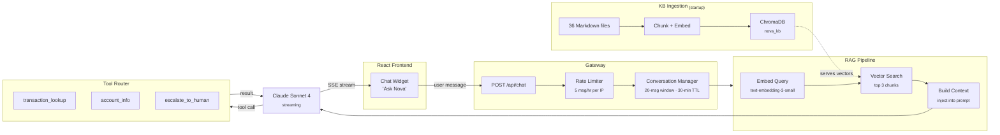

# Nova

AI-powered customer support agent embedded in a neobank dashboard. Built by [Devbrew](https://devbrew.ai).

<!-- TODO(assets): hero GIF — capture ~6s loop of dashboard load + chat trigger click + suggested-prompt selection + tool-use indicator + streaming response. Save as nova-demo.gif at repo root. Embed:  -->

**[Try the live demo →](https://nova.devbrew.ai)**

## Features

- **Knowledge-grounded answers** — RAG over a 36-doc fintech knowledge base, retrieved via ChromaDB and OpenAI embeddings before every response
- **Tool use** — looks up transactions, fetches account info, and escalates to humans via email when it can't help
- **Streaming UX** — Server-Sent Events stream tokens as they generate, with tool-use status indicators inline
- **Multi-turn conversations** — 20-message sliding window with 30-min TTL, fully in-memory (no DB)
- **Production-ready foundations** — IP rate limiting, structured config, type-checked Python and TypeScript, ~100 backend tests

## Tech stack

| Layer      | Technology                                                       |
| ---------- | ---------------------------------------------------------------- |
| Frontend   | React 19, TypeScript, Vite, Tailwind CSS, Base UI (shadcn-style) |
| Backend    | Python 3.11+, FastAPI                                            |
| LLM        | Claude Sonnet 4 (`claude-sonnet-4-20250514`)                     |
| Embeddings | OpenAI `text-embedding-3-small`                                  |
| Vector DB  | ChromaDB                                                         |
| Streaming  | Server-Sent Events (SSE)                                         |

## Architecture

A React dashboard renders the mock neobank UI and an "Ask Nova" floating chat bubble. The bubble streams over SSE to a FastAPI backend that runs a RAG pipeline (OpenAI embeddings → ChromaDB) and dispatches tool calls (transaction lookup, account info, human escalation) before streaming the LLM response back.

### How the AI agent works



**Flow:** User sends a message → rate limiter checks → conversation history is loaded → the RAG pipeline embeds the query and retrieves relevant knowledge base chunks from ChromaDB → retrieved context is injected into the system prompt → Claude generates a response, optionally calling tools (transaction lookup, account info, or escalation) → the response streams back to the chat widget as SSE events.

<!-- TODO(assets): static dashboard screenshot — same scene as final frame of hero GIF (Nova dashboard with chat panel open showing a complete conversation). Save as nova-dashboard.png at repo root. Embed:  -->

## Project structure

```
nova/
├── backend/                          FastAPI + RAG pipeline + Anthropic Claude
│   ├── app/
│   │   ├── main.py                   App init, lifespan hooks, KB ingestion on startup
│   │   ├── config.py                 Pydantic Settings (API keys, model, paths, limits)
│   │   ├── routers/
│   │   │   ├── chat.py               POST /api/chat (SSE streaming)
│   │   │   ├── account.py            GET  /api/account (mock user)
│   │   │   ├── transactions.py       GET  /api/transactions (mock data)
│   │   │   └── health.py             GET  /api/health
│   │   ├── services/
│   │   │   ├── llm.py                Claude client, system prompt, tool schemas
│   │   │   ├── chat_orchestrator.py  RAG → LLM → tool loop → SSE event yielder
│   │   │   ├── retrieval.py          Vector search + threshold filter
│   │   │   ├── embedding.py          OpenAI text-embedding-3-small
│   │   │   ├── vector_store.py       ChromaDB collection (`nova_kb`)
│   │   │   ├── chunker.py            Paragraph-aware chunking (~400 tok, 1-para overlap)
│   │   │   ├── ingestion.py          KB load → chunk → embed → store pipeline
│   │   │   ├── knowledge_base.py     Markdown loader for `data/knowledge_base/`
│   │   │   ├── tools.py              transaction_lookup, account_info, escalate_to_human
│   │   │   ├── conversation.py       In-memory 20-msg sliding window, 30-min TTL
│   │   │   ├── rate_limiter.py       IP-based, 5 msg/hr default
│   │   │   └── email.py              Resend integration for escalations
│   │   ├── models/                   Pydantic request/response schemas
│   │   └── data/
│   │       ├── account.json          Mock "Alex Rivera" profile
│   │       └── transactions.json     Mock transaction history
│   ├── data/knowledge_base/          36 markdown KB articles (account, cards, transfers…)
│   ├── tests/                        ~100 pytest tests covering routes, RAG, tools, flows
│   ├── pyproject.toml
│   ├── Dockerfile                    Render deployment
│   └── .env.example
│
├── frontend/                         React 19 + Vite + Tailwind + Base UI
│   ├── src/
│   │   ├── App.tsx                   Page router (home / transactions / cards / settings)
│   │   ├── main.tsx                  React entry point
│   │   ├── components/
│   │   │   ├── sidebar.tsx           Collapsible nav
│   │   │   ├── account-summary.tsx   Balance card with animated counter
│   │   │   ├── balance-chart.tsx     Recharts visualization
│   │   │   ├── transaction-list.tsx  Date-grouped transaction feed
│   │   │   ├── chat-trigger.tsx      Floating "Ask Nova" button
│   │   │   ├── chat/                 Chat panel, message list, input, tool status, etc.
│   │   │   └── ui/                   shadcn-style primitives (button, card, badge…)
│   │   ├── hooks/use-chat.ts         SSE consumer + chat state machine
│   │   ├── services/api.ts           Backend fetch client
│   │   ├── data/                     Frontend mock data (account, transactions)
│   │   └── types/                    Shared TypeScript interfaces
│   ├── package.json
│   └── vite.config.ts
│
├── render.yaml                       Render service definition (backend)
├── README.md                         You are here
├── CLAUDE.md                         Workflow and conventions for Claude Code sessions
├── PRD.md                            Original product requirements
└── LICENSE                           MIT
```

## Quick start

### Backend

Copy `backend/.env.example` to `backend/.env` and fill in `ANTHROPIC_API_KEY` and `OPENAI_API_KEY` — both are required (Anthropic for the LLM, OpenAI for embeddings). The knowledge base ingests automatically into ChromaDB on first startup.

```bash
cd backend
python3 -m venv venv
source venv/bin/activate
pip install -e ".[dev]"
uvicorn app.main:app --reload
```

### Frontend

```bash
cd frontend
bun install
bun run dev
```

## Environment variables

| Variable                | Where    | Description                                                          |
| ----------------------- | -------- | -------------------------------------------------------------------- |
| `ANTHROPIC_API_KEY`     | Backend  | Claude API key (required)                                            |
| `ANTHROPIC_MODEL`       | Backend  | Claude model ID (default: `claude-sonnet-4-20250514`)                |
| `OPENAI_API_KEY`        | Backend  | OpenAI API key for embeddings (required)                             |
| `RESEND_API_KEY`        | Backend  | Resend API key for escalation emails (optional)                      |
| `CHROMA_PERSIST_DIR`    | Backend  | ChromaDB storage path (default: `./chroma_data`)                     |
| `KNOWLEDGE_BASE_DIR`    | Backend  | Markdown KB directory (default: `./data/knowledge_base`)             |
| `CORS_ORIGINS`          | Backend  | Allowed origins, comma-separated (default: `http://localhost:5173`)  |
| `LOG_LEVEL`             | Backend  | Logging level (default: `INFO`)                                      |
| `CHAT_RATE_LIMIT`       | Backend  | Messages per hour per IP (default: `5`)                              |
| `ESCALATION_TO_EMAIL`   | Backend  | Recipient for human escalations (default: `hello@devbrew.ai`)        |
| `ESCALATION_FROM_EMAIL` | Backend  | Sender address for escalation emails (default: `nova@notify.devbrew.ai`) |
| `AGENT_FROM_NAME`       | Backend  | Display name for the agent (default: `Nova`)                         |
| `VITE_API_URL`          | Frontend | Backend URL                                                          |

## Development

### Backend

```bash
cd backend
ruff check . && ruff format --check .   # lint
mypy .                                   # type-check
pytest                                   # run the test suite
```

### Frontend

```bash
cd frontend
bun run lint                             # lint
bunx tsc --noEmit                        # type-check
bun test                                 # run tests
```

Every change should pass lint, type-check, and tests before commit. See [`CLAUDE.md`](CLAUDE.md) for the full development workflow and commit conventions.

## License

[MIT](LICENSE)
